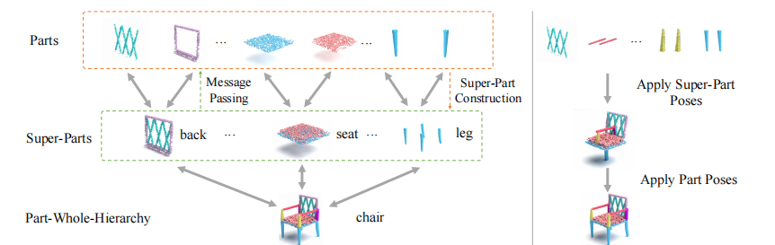

# Generative 3D Part Assembly via Part-Whole-Hierarchy Message Passing

This is the implementation of CVPR 2024 paper "Generative 3D Part Assembly via Part-Whole-Hierarchy Message Passing".

Left: an illustration of the part-whole-hierarchy for 3D shapes; Right: the part assembly process via the proposed part-whole-hierarchy message passing network.

## Environment
This code is test on Ubuntu 20.04 with CUDA 11.7, GCC 9.4.0, Python 3.7.12, Pytorch 1.7.1 and Pytorch3D 0.5.0.

Follow the steps to set up the environment:

    conda env create -f 3DHPA.yml
    conda activate 3DHPA
    
    pip3 install torch==1.7.1+cu110 torchvision==0.8.2+cu110 torchaudio==0.7.2 -f https://download.pytorch.org/whl/torch_stable.html
    
    cd exps/utils/cd
    python3 setup.py build develop

## Dataset
Download the [pre-processed]() data for the .npy data files in file prepare_data/

## Quick Start
#### Train on the Table/Chair/Lamp category:

    cd exps/method
    bash train_hpa.sh

#### Test on the Table/Chair/Lamp category

    cd exps/method
    bash inference_hpa.sh $your path of the model

Note: you can specify the GPUs in training in the script by change "NUM_GUPS" and "CUDA_VISIBLE_DEVICES"

## Citation
Please cite our paper if you use any part of the code from this repository:

    @article{du2024generative,
        title={Generative 3D Part Assembly via Part-Whole-Hierarchy Message Passing},
        author={Du, Bi'an and Gao, Xiang and Hu, Wei and Liao, Renjie},
        journal={arXiv preprint arXiv:2402.17464},
        year={2024}
    }

## Acknowledgement
This code is established upon the source code of "Generative 3D Part Assembly via Dynamic Graph Learning".
